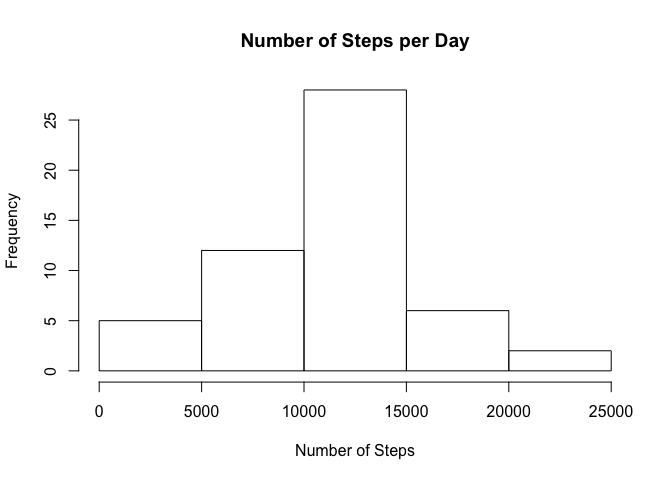
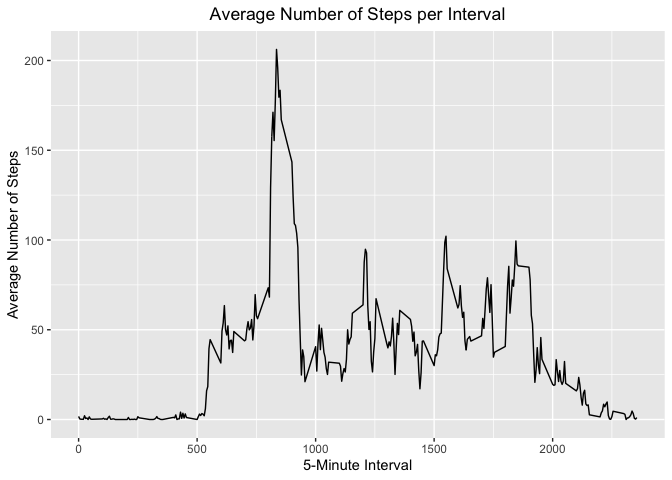
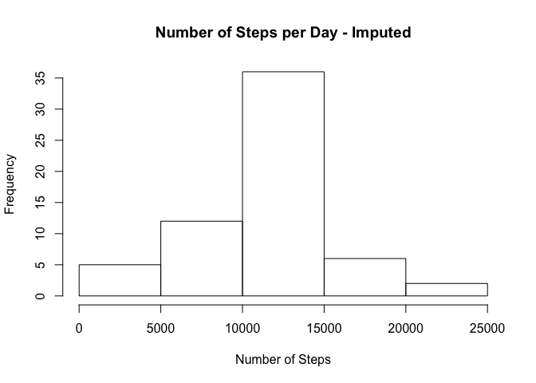
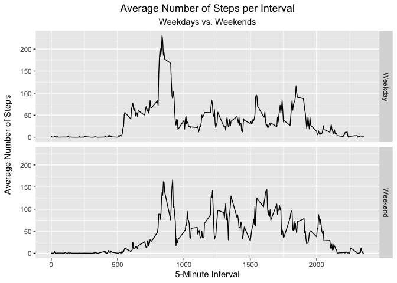

## Loading and preprocessing the data

The first step is unzip the data file and load it.


```r
#unzips the file
unzip("activity.zip", exdir = "./")

#loads the data
activity <- read.csv("activity.csv")
```

I will convert the data frame to a data table.


```r
library(data.table, quietly = TRUE)

activity <- as.data.table(activity)
```

In this analyis, I will use a subset of the original data set by excluding the missing values from the steps column.

```r
activity.clean <- activity[!is.na(activity$steps),]
```


## What is mean total number of steps taken per day?

### Question 1: Make a histogram of the total number of steps taken each day.

Calculating the total number of steps taken each day:

```r
SumSteps <- activity.clean[,.(tot.steps = sum(steps)), by = date]
```

Making a histogram of the total number of steps taken each day:


```r
hist(SumSteps$tot.steps, xlab = "Number of Steps", main = "Number of Steps per Day")
```

<!-- -->

### Question 2: Calculate and report the mean and median total number of steps taken per day.

Calculating the mean and median total number of steps taken per day:


```r
mean.tot.steps <- SumSteps[,as.integer(mean(tot.steps))] 
mean.tot.steps
```

```
## [1] 10766
```

```r
med.tot.steps <- SumSteps[,as.integer(median(tot.steps))] 
med.tot.steps
```

```
## [1] 10765
```

The mean and median number of steps per day are 10766 and 10765, respectively.


## What is the average daily activity pattern?

### Question 1: Make a time series plot (i.e. type = "l") of the 5-minute interval (x-axis) and the average number of steps taken, averaged across all days (y-axis)

Calculating the average number of steps taken each 5-minute interval, averaged across all days:

```r
AvgSteps <- activity.clean[,.(avg.steps = mean(steps)), by = interval]
```

Now making a time series plot to show the data:

```r
library(ggplot2)

ggplot(AvgSteps, aes(x = interval, y = avg.steps)) +
        geom_line() +
        theme(plot.title = element_text(hjust = 0.5)) + 
        labs(title = "Average Number of Steps per Interval", x = "5-Minute Interval", y = "Average Number of Steps")
```

<!-- -->

### Question 2: Which 5-minute interval, on average across all the days in the dataset, contains the maximum number of steps?


```r
AvgSteps[which.max(AvgSteps$avg.steps),]
```

```
##    interval avg.steps
## 1:      835  206.1698
```

The 5-minute interval that contained the maximum number of steps was the 835 interval with 206 steps.

## Imputing missing values

### Question 1: Calculate and report the total number of missing values in the dataset (i.e. the total number of rows with NAs).


```r
sum(is.na(activity$steps))
```

```
## [1] 2304
```
The total number of rows with missing values in the dataset is 2,304.

### Question 2: Devise a strategy for filling in all of the missing values in the dataset. The strategy does not need to be sophisticated. For example, you could use the mean/median for that day, or the mean for that 5-minute interval, etc.

I will use the mean for that 5-minute interval to fill in the missing values. For example, the average number of steps for the 835 interval is 206.1698, so I will use that value to fill in any 835 interval rows that currently have an NA value in it.

### Question 3: Create a new dataset that is equal to the original dataset but with the missing data filled in.

Creating a new data set using the strategy desribed above:


```r
#adds average number of steps for each 5-minute interval to the main dataset
activity.NoNA <- merge(activity, AvgSteps, by = "interval")

#populates steps rows with mean for that 5-minute inteval if it has NA value
activity.NoNA$steps <- ifelse(is.na(activity.NoNA$steps), activity.NoNA$avg.steps, activity.NoNA$steps)

#deletes the avg.steps column
activity.NoNA <- activity.NoNA[,c(1:3)]
```

### Question 4: Make a histogram of the total number of steps taken each day and Calculate and report the mean and median total number of steps taken per day. Do these values differ from the estimates from the first part of the assignment? What is the impact of imputing missing data on the estimates of the total daily number of steps?

Calculating the total number of steps taken each day, with imputed values:

```r
SumSteps.Imputed <- activity.NoNA[,.(tot.steps = sum(steps)), by = date]
```


Histogram of the total number of steps taken each day:

```r
hist(SumSteps.Imputed$tot.steps, xlab = "Number of Steps", main = "Number of Steps per Day - Imputed")
```

<!-- -->

Calculating the mean and median values for the total number of steps taken per day:

```r
SumSteps.Imputed[,as.integer(mean(tot.steps))] 
```

```
## [1] 10766
```

```r
SumSteps.Imputed[,as.integer(median(tot.steps))]
```

```
## [1] 10766
```

The mean and median values for the total number of steps taken per day are both 10,766.

The mean for this analysis remains the same as the one calculated prior to imputation, which should be the case since I filled in the NA values with the mean. The median for this analysis is higher by a value of 1 (previous median = 10,765 and this median = 10,766).

## Are there differences in activity patterns between weekdays and weekends?

### Question 1: Create a new factor variable in the dataset with two levels -- "weekday" and "weekend" indicating whether a given date is a weekday or weekend day.


```r
activity.NoNA$day.type <- 
  factor(ifelse(weekdays(as.Date(activity.NoNA$date)) == "Saturday" | weekdays(as.Date(activity.NoNA$date)) == "Sunday", "Weekend", "Weekday"))
```


### Question 2: Make a panel plot containing a time series plot (i.e. type = "l") of the 5-minute interval (x-axis) and the average number of steps taken, averaged across all weekday days or weekend days (y-axis).

Calculating the average number of steps for each 5-minute interval, averaged across weekdays or weekends:

```r
AvgSteps.Imputed <- activity.NoNA[,.(avg.steps = mean(steps)), by = list(interval, day.type)]
```

Making the panel plot:

```r
ggplot(AvgSteps.Imputed, aes(x = interval, y = avg.steps)) +
  geom_line() +
  labs(title = "Average Number of Steps per Interval", subtitle = "Weekdays vs. Weekends", x = "5-Minute Interval", y = "Average Number of Steps") + 
  theme(plot.title = element_text(hjust = 0.5), plot.subtitle = element_text(hjust = 0.5), axis.title.y = element_text(margin = margin(r = 10))) + 
  facet_grid(day.type ~.)
```

<!-- -->

There are differences in activity patterns between weekdays and weekends. It looks like the averages are slightly higher for the weekends, especially after 1000.

